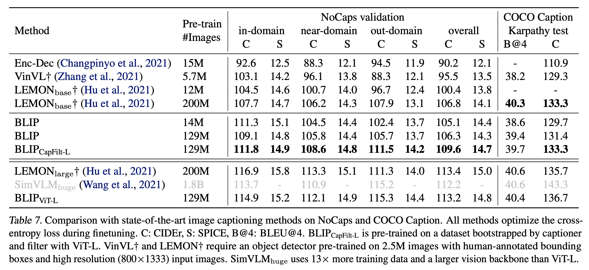

# Image captioning demo

## 1. Model Introduction - BLIP:
Bootstrapping Language-Image Pre-training (BLIP) model, a powerful tool for unified vision-language understanding and generation. This model utilizes a combination of pre-training techniques, including bootstrapping and self-supervised learning, to bridge the gap between image and language processing. With its ability to understand and generate both visual and textual data, the BLIP model has achieved state-of-the-art performance on many vision-language tasks. 



## 2. Installation:
Look through `.env` file to change anything if you need before setting up things
### Presquite

### Database
```
cd database/
docker compose --env-file ../.env  up -d --force-recreate
```
### API & Client
Install required Python libraries
```
pip install -r requirements.txt
```
Running the API server, currently, API is running at port `8082`
```
cd api/
sh run_server.sh
````
Running the client server, currently, client is running at port `8080`

## 3. Customize
Model configuration is saved in `api/configs/custom_BLIP_captioning.yml`

