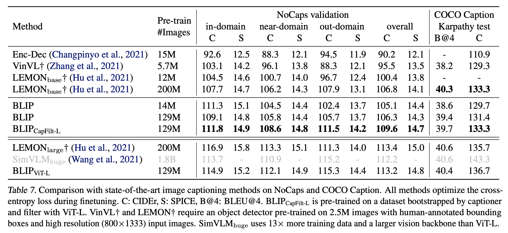
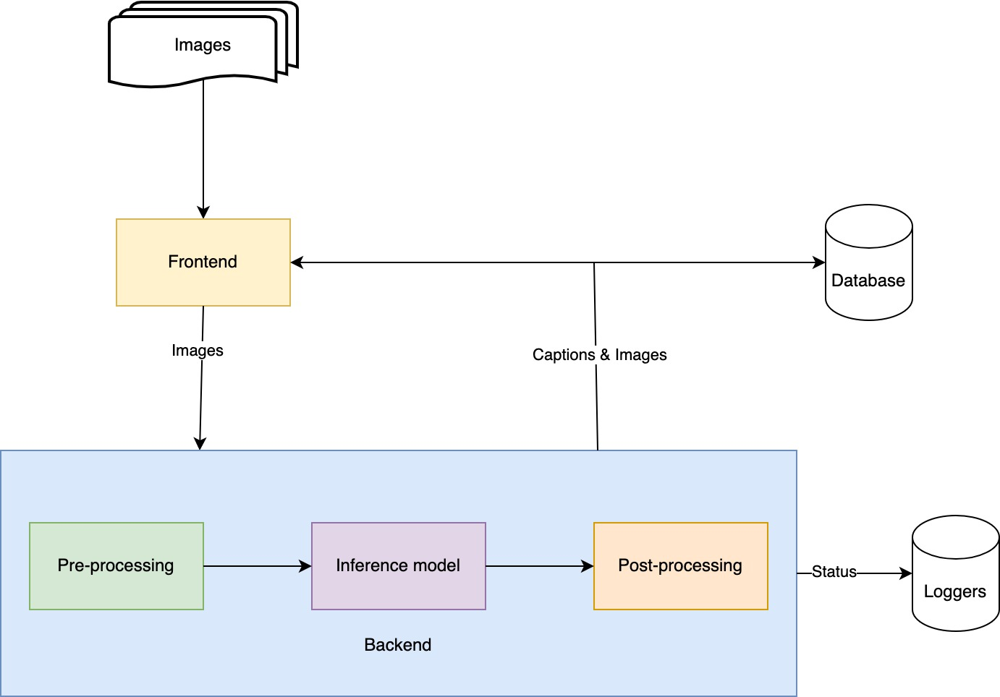
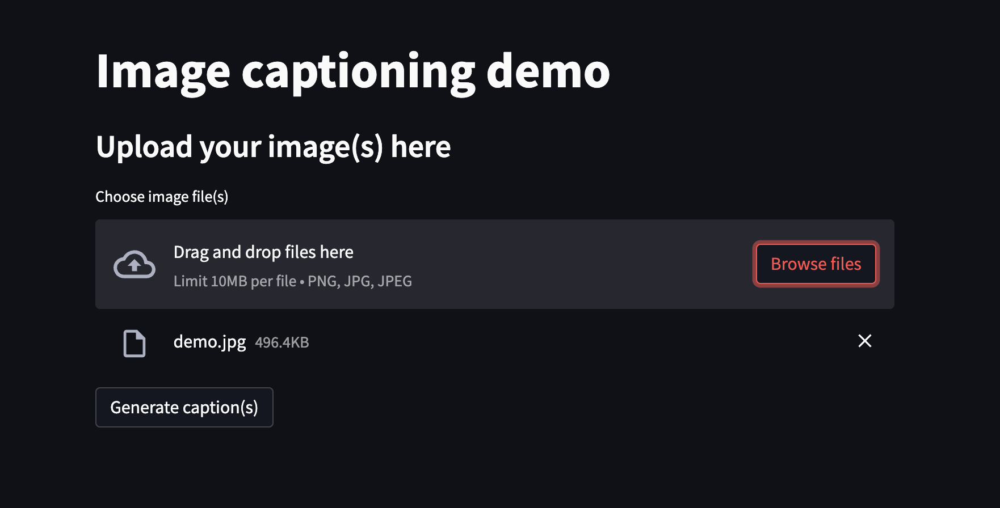
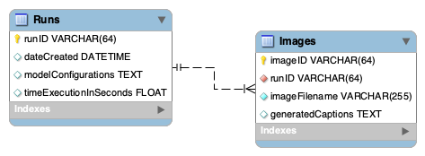

# Image captioning demo

## 1. Model Introduction - BLIP:
Bootstrapping Language-Image Pre-training (BLIP) model, a powerful tool for unified vision-language understanding and generation. This model utilizes a combination of pre-training techniques, including bootstrapping and self-supervised learning, to bridge the gap between image and language processing. With its ability to understand and generate both visual and textual data, the BLIP model has achieved state-of-the-art performance on many vision-language tasks. 


## 2. System design

### a. Frontend
- User will upload images using frontend. From here, images will be sent to backend API to generate captions. 
- Streamlit is used to design the interface. Also, images will be size limited 10MB for each file and only images file type are allowed (`.png`, `.jpg`, `.jpeg`).


### b. Backend
* API info.
    - Method: POST
    - URL: `http://{api_hostname}:{api_port}/api/{api_version}/generate_captions`
    - Content Type: `multipart/form-data`
    - Response Type: `text/json`
    - Body structure:

    |Parameters|Datatypes|Mandatory|Description|
    |-|-|-|-|
    |filenames|List[string]|True| List of image filenames|
    |images|List[BinaryFile]|True| List of images (binary)|
* Description:
    After receiving filenames and images from frontend, it will create an images dict. Then a Torch dataloader will be created for the inference model. Model will take this dataloader and then produce corresponding captions. Filenames and captions will be packed in a dict that has the below structure.
    ```
    [
        {
            "filename": filename1,
            "caption": caption1,
        },
        ...
    ]
    ```

### c. Database


This database will store images and their metadata, captions after processing by the model. There are two tables: `Runs` and `Images`. Table `Runs` will store each run information (date create, model configurations, time execution) for further analysis. Table `Images` will store information about the corresponding images (filename, generated captions, etc.) 

## 3. Codebase structure:
Following the above system design, codebase is organized based on the function of each module.

## 4. Installation:
Look through `.env` file to change anything if you need before setting up things

### Prerequisite
- Python 3.9
- Docker Compose 2.12

### Database
```
cd database/
docker compose --env-file ../.env  up -d --force-recreate
```
### API & Client
Install required Python libraries
```
pip install -r requirements.txt
```
Running the API server, currently, API is running at port `8082`
```
cd api/
sh run_server.sh
````
Running the client server, currently, client is running at port `8080`
```
cd client/
sh run_client.sh
````

## 5. Customize
- All of enviroment variables are stored in `.env` file.
- Model configuration is saved in `api/configs/custom_BLIP_captioning.yml`


